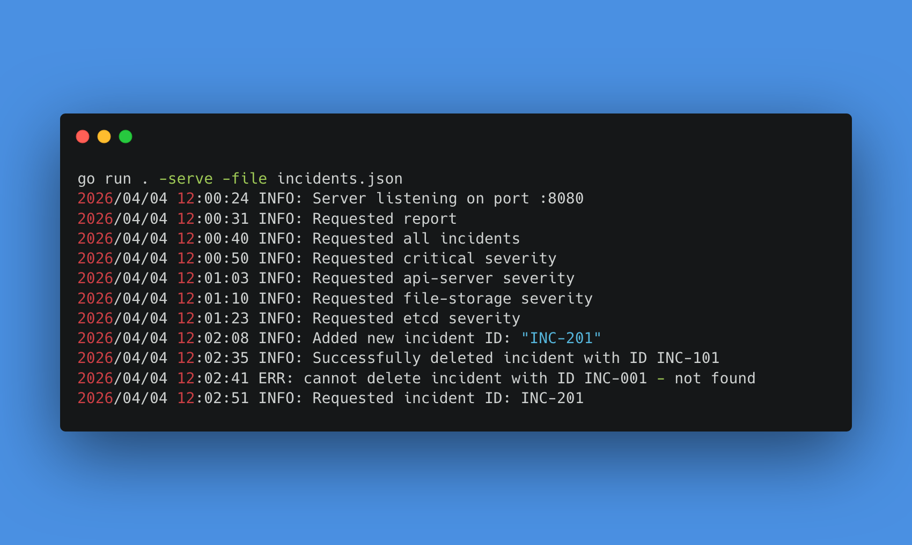
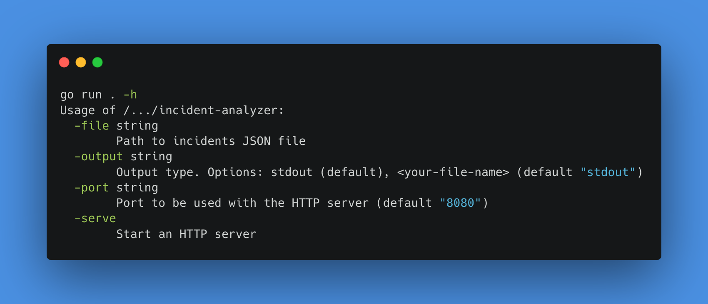

# Incident Log Analyzer

## What it does

- Reads a JSON file of incidents
- Parses incidents into Go structs
- Calculates MTTR (mean time to recovery)
- Finds unresolved incidents
- Groups incidents by severity and by service
- Outputs a structured JSON report to stdout or a file (-output flag)

## Go concepts learned and used

1. Variables, types
2. Slices, Maps and Structs
3. Functions with multiple return values, including errors
4. `flag` package for CLI arguments
5. `encoding/json` — Marshal and Unmarshal
6. `os.ReadFile` / `os.WriteFile`
7. `time.Parse` and `time.Duration`
8. `fmt.Println`, `fmt.Sprintf`, `log` package
9. `go test` — writing your first test
10. `net/http` package for exposing APIs
11. `sync.RWMutex` for parallel read or one write lock
12. Validator (ext. lib) that checks POST request struct
13. `database/sql` with `pgx` for persistent data storage in PG database

**This project does not use those concepts:** goroutines, channels

## Available parameters



## Running with `go run`

To run Go code by compiling it and immidiately running it:

```bash
# incidents.json file is used as an example
go run main.go -file incidents.json

# Output to file is optional as stdout is default method that can be further parsed with JQ
go run main.go -file incidents.json -output my-output.json
```

## Compiling Go code

To compile Go code you can use this command:

```bash
go build main.go
```

Compilation is very quick, and file is by default called just `main`.

### Running compiled Go code

To run compiled Go code simply write the name of the program - by default it's `main`:

```bash
main -file incidents.json
```

However if program is located somewhere else:

```bash
/path/to/main -file incidents.json

# or
./another/path/to/main -file incidents.json
```

## Go test

Tested one function `CalcMTTRAvg()`:


## Output example

Here is example output that you can expect by running the Go program againgst example `incidents.json` file:

```json
{
  "incidents_count": 9,
  "unresolved_ids": [
    "INC-105",
    "INC-109"
  ],
  "mttr": "1h18m51s",
  "by_services": {
    "api-server": {
      "INC-104": {
        "title": "SSL/TLS handshake failures on API endpoint",
        "severity": "critical",
        "message": "Resolved in 45m0s (Ended: 2026-03-17T10:30:00Z)",
        "is_resolved": true
      }
    },
    "elasticsearch-client": {
      "INC-105": {
        "title": "Memory leak in search indexing service",
        "severity": "medium",
        "message": "Pending (Started: 2026-03-16T21:00:00Z)",
        "is_resolved": false
      }
    },
    "event-processor": {
      "INC-102": {
        "title": "Message queue consumer lag exceeding threshold",
        "severity": "critical",
        "message": "Resolved in 1h25m0s (Ended: 2026-03-19T16:55:00Z)",
        "is_resolved": true
      }
    },
    "file-storage": {
      "INC-103": {
        "title": "Storage quota exceeded on shared NFS mount",
        "severity": "high",
        "message": "Resolved in 1h50m0s (Ended: 2026-03-18T15:10:00Z)",
        "is_resolved": true
      }
    },
    "ingress-controller": {
      "INC-101": {
        "title": "Load balancer certificate expiration in 7 days",
        "severity": "high",
        "message": "Resolved in 1h27m0s (Ended: 2026-03-20T11:42:00Z)",
        "is_resolved": true
      }
    },
    "mysql-replica": {
      "INC-107": {
        "title": "Database replication lag detected",
        "severity": "medium",
        "message": "Resolved in 1h15m0s (Ended: 2026-03-14T12:45:00Z)",
        "is_resolved": true
      }
    },
    "proxy-service": {
      "INC-109": {
        "title": "Persistent connection pool saturation in gateway",
        "severity": "critical",
        "message": "Pending (Started: 2026-03-12T16:40:00Z)",
        "is_resolved": false
      }
    },
    "service-mesh": {
      "INC-106": {
        "title": "DNS resolution timeout for external dependencies",
        "severity": "high",
        "message": "Resolved in 1h25m0s (Ended: 2026-03-15T15:50:00Z)",
        "is_resolved": true
      }
    },
    "web-frontend": {
      "INC-108": {
        "title": "Pod eviction due to resource requests misconfiguration",
        "severity": "low",
        "message": "Resolved in 1h5m0s (Ended: 2026-03-13T09:20:00Z)",
        "is_resolved": true
      }
    }
  },
  "by_severity": {
    "critical": {
      "INC-102": {
        "title": "Message queue consumer lag exceeding threshold",
        "service": "event-processor",
        "message": "Resolved in 1h25m0s (Ended: 2026-03-19T16:55:00Z)",
        "is_resolved": true
      },
      "INC-104": {
        "title": "SSL/TLS handshake failures on API endpoint",
        "service": "api-server",
        "message": "Resolved in 45m0s (Ended: 2026-03-17T10:30:00Z)",
        "is_resolved": true
      },
      "INC-109": {
        "title": "Persistent connection pool saturation in gateway",
        "service": "proxy-service",
        "message": "Pending (Started: 2026-03-12T16:40:00Z)",
        "is_resolved": false
      }
    },
    "high": {
      "INC-101": {
        "title": "Load balancer certificate expiration in 7 days",
        "service": "ingress-controller",
        "message": "Resolved in 1h27m0s (Ended: 2026-03-20T11:42:00Z)",
        "is_resolved": true
      },
      "INC-103": {
        "title": "Storage quota exceeded on shared NFS mount",
        "service": "file-storage",
        "message": "Resolved in 1h50m0s (Ended: 2026-03-18T15:10:00Z)",
        "is_resolved": true
      },
      "INC-106": {
        "title": "DNS resolution timeout for external dependencies",
        "service": "service-mesh",
        "message": "Resolved in 1h25m0s (Ended: 2026-03-15T15:50:00Z)",
        "is_resolved": true
      }
    },
    "low": {
      "INC-108": {
        "title": "Pod eviction due to resource requests misconfiguration",
        "service": "web-frontend",
        "message": "Resolved in 1h5m0s (Ended: 2026-03-13T09:20:00Z)",
        "is_resolved": true
      }
    },
    "medium": {
      "INC-105": {
        "title": "Memory leak in search indexing service",
        "service": "elasticsearch-client",
        "message": "Pending (Started: 2026-03-16T21:00:00Z)",
        "is_resolved": false
      },
      "INC-107": {
        "title": "Database replication lag detected",
        "service": "mysql-replica",
        "message": "Resolved in 1h15m0s (Ended: 2026-03-14T12:45:00Z)",
        "is_resolved": true
      }
    }
  }
}
```

## Issues & Contributing

If you have any problems or ideas on other features to add, feel free to open an issue or create Pull Request.
