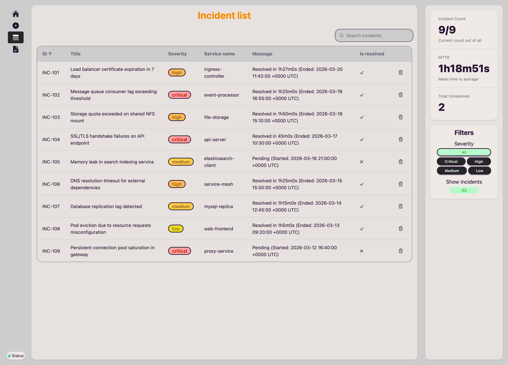
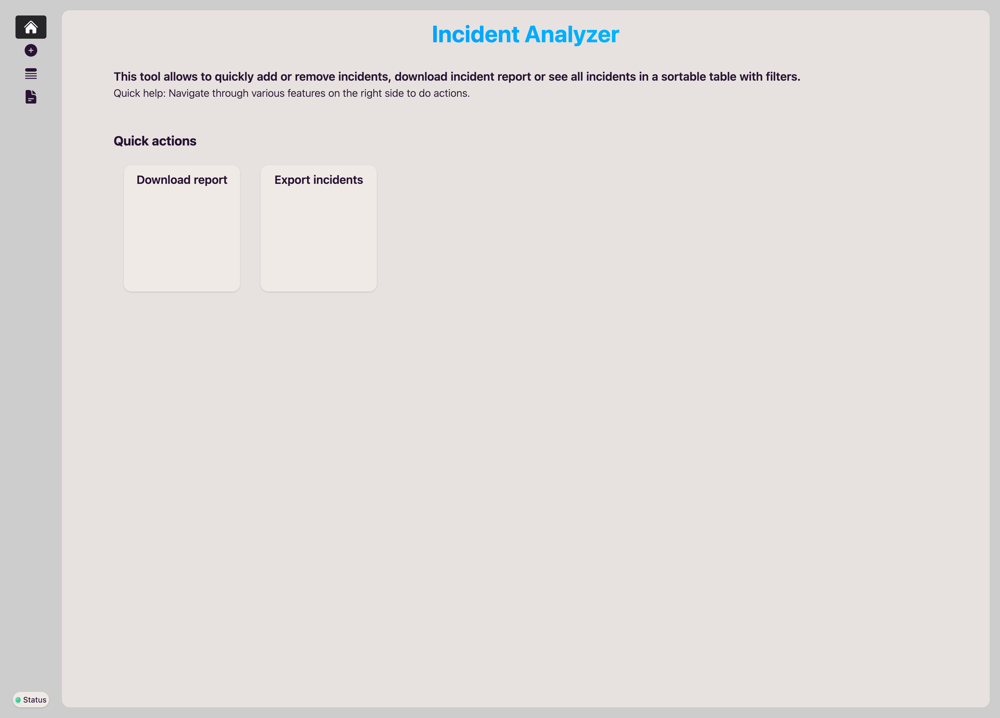
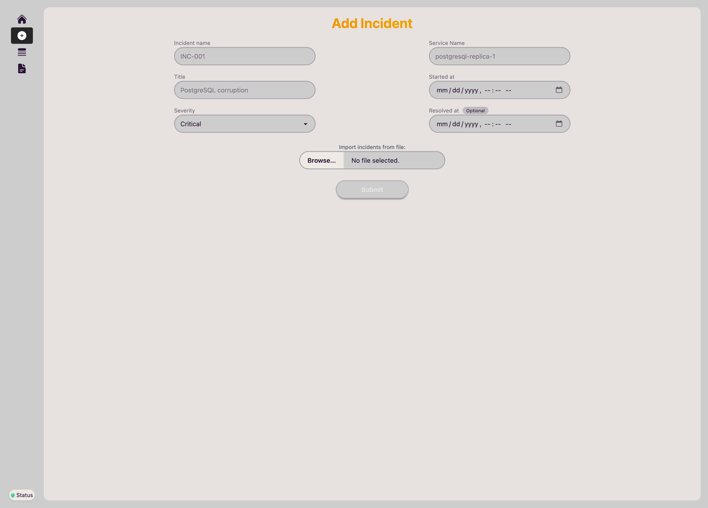
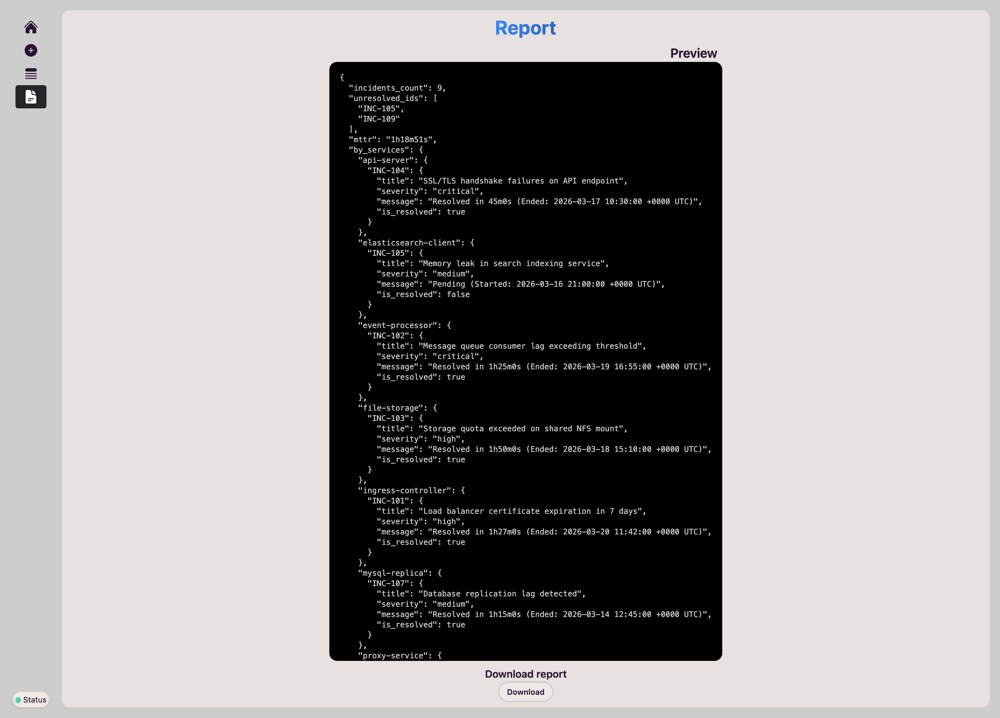
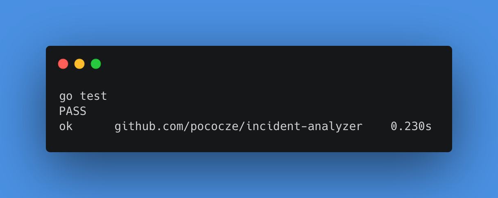

# Incident Log Analyzer

This tool allows to quickly add or remove incidents, download incident report or see all incidents within sortable table with filters.

## REST API endpoints reference

| HTTP method | Endpoint name | Handler name | Note |
| ----------- | ------------- | ------------ | ---- |
| GET | /healthz | healthHandler | Backend status health |
| GET | /report | getReportHandler | Return incident report |
| GET | /incidents | getAllHandler | Return list of incidents |
| POST | /incidents | addListHandler | Retrives list of incidents |
| POST | /incident | addHandler | Retrives one incident |
| GET | /incidents/{id} | getByIDHandler | Return one incident by ID |
| DELETE | /incidents/{id} | deleteByIDHandler | Delete one incident by ID |

## Screenshots





## REST API `/report` endpoint example

```json
{
  "incidents_count": 9,
  "unresolved_ids": [
    "INC-105",
    "INC-109"
  ],
  "mttr": "1h18m51s",
  "by_services": {
    "api-server": {
      "INC-104": {
        "title": "SSL/TLS handshake failures on API endpoint",
        "severity": "critical",
        "message": "Resolved in 45m0s (Ended: 2026-03-17T10:30:00Z)",
        "is_resolved": true
      }
    },
    "elasticsearch-client": {
      "INC-105": {
        "title": "Memory leak in search indexing service",
        "severity": "medium",
        "message": "Pending (Started: 2026-03-16T21:00:00Z)",
        "is_resolved": false
      }
    },
    "event-processor": {
      "INC-102": {
        "title": "Message queue consumer lag exceeding threshold",
        "severity": "critical",
        "message": "Resolved in 1h25m0s (Ended: 2026-03-19T16:55:00Z)",
        "is_resolved": true
      }
    },
    "file-storage": {
      "INC-103": {
        "title": "Storage quota exceeded on shared NFS mount",
        "severity": "high",
        "message": "Resolved in 1h50m0s (Ended: 2026-03-18T15:10:00Z)",
        "is_resolved": true
      }
    },
    "ingress-controller": {
      "INC-101": {
        "title": "Load balancer certificate expiration in 7 days",
        "severity": "high",
        "message": "Resolved in 1h27m0s (Ended: 2026-03-20T11:42:00Z)",
        "is_resolved": true
      }
    },
    "mysql-replica": {
      "INC-107": {
        "title": "Database replication lag detected",
        "severity": "medium",
        "message": "Resolved in 1h15m0s (Ended: 2026-03-14T12:45:00Z)",
        "is_resolved": true
      }
    },
    "proxy-service": {
      "INC-109": {
        "title": "Persistent connection pool saturation in gateway",
        "severity": "critical",
        "message": "Pending (Started: 2026-03-12T16:40:00Z)",
        "is_resolved": false
      }
    },
    "service-mesh": {
      "INC-106": {
        "title": "DNS resolution timeout for external dependencies",
        "severity": "high",
        "message": "Resolved in 1h25m0s (Ended: 2026-03-15T15:50:00Z)",
        "is_resolved": true
      }
    },
    "web-frontend": {
      "INC-108": {
        "title": "Pod eviction due to resource requests misconfiguration",
        "severity": "low",
        "message": "Resolved in 1h5m0s (Ended: 2026-03-13T09:20:00Z)",
        "is_resolved": true
      }
    }
  },
  "by_severity": {
    "critical": {
      "INC-102": {
        "title": "Message queue consumer lag exceeding threshold",
        "service": "event-processor",
        "message": "Resolved in 1h25m0s (Ended: 2026-03-19T16:55:00Z)",
        "is_resolved": true
      },
      "INC-104": {
        "title": "SSL/TLS handshake failures on API endpoint",
        "service": "api-server",
        "message": "Resolved in 45m0s (Ended: 2026-03-17T10:30:00Z)",
        "is_resolved": true
      },
      "INC-109": {
        "title": "Persistent connection pool saturation in gateway",
        "service": "proxy-service",
        "message": "Pending (Started: 2026-03-12T16:40:00Z)",
        "is_resolved": false
      }
    },
    "high": {
      "INC-101": {
        "title": "Load balancer certificate expiration in 7 days",
        "service": "ingress-controller",
        "message": "Resolved in 1h27m0s (Ended: 2026-03-20T11:42:00Z)",
        "is_resolved": true
      },
      "INC-103": {
        "title": "Storage quota exceeded on shared NFS mount",
        "service": "file-storage",
        "message": "Resolved in 1h50m0s (Ended: 2026-03-18T15:10:00Z)",
        "is_resolved": true
      },
      "INC-106": {
        "title": "DNS resolution timeout for external dependencies",
        "service": "service-mesh",
        "message": "Resolved in 1h25m0s (Ended: 2026-03-15T15:50:00Z)",
        "is_resolved": true
      }
    },
    "low": {
      "INC-108": {
        "title": "Pod eviction due to resource requests misconfiguration",
        "service": "web-frontend",
        "message": "Resolved in 1h5m0s (Ended: 2026-03-13T09:20:00Z)",
        "is_resolved": true
      }
    },
    "medium": {
      "INC-105": {
        "title": "Memory leak in search indexing service",
        "service": "elasticsearch-client",
        "message": "Pending (Started: 2026-03-16T21:00:00Z)",
        "is_resolved": false
      },
      "INC-107": {
        "title": "Database replication lag detected",
        "service": "mysql-replica",
        "message": "Resolved in 1h15m0s (Ended: 2026-03-14T12:45:00Z)",
        "is_resolved": true
      }
    }
  }
}
```

## Go test

Tested one function `CalcMTTRAvg()`:



## Issues & Contributing

If you have any problems or ideas on other features to add, feel free to open an issue or create Pull Request.
