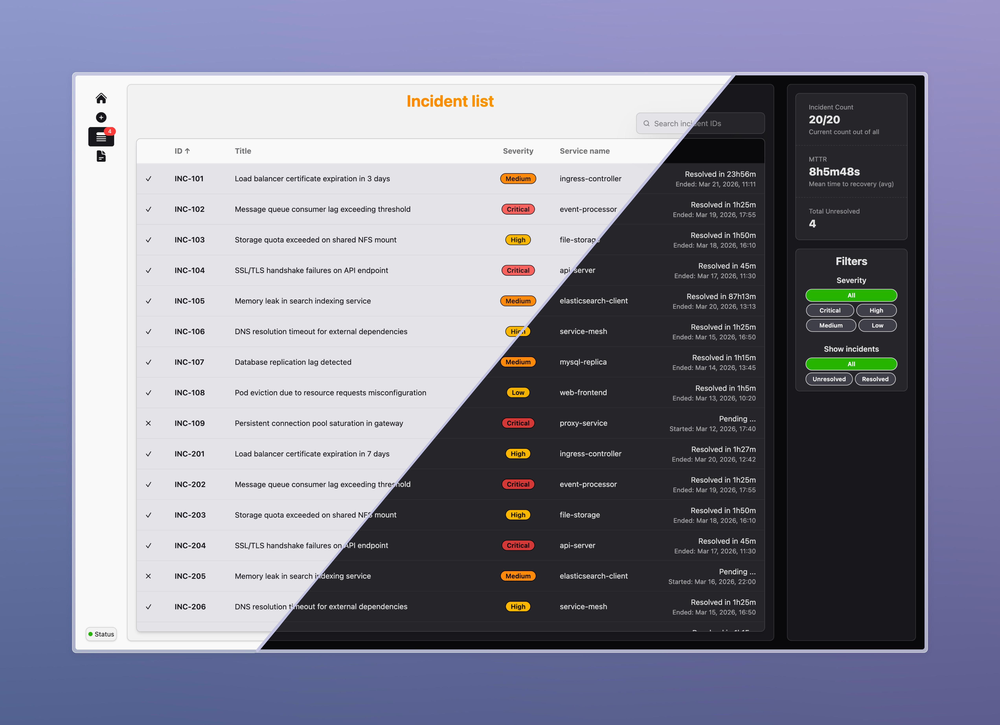
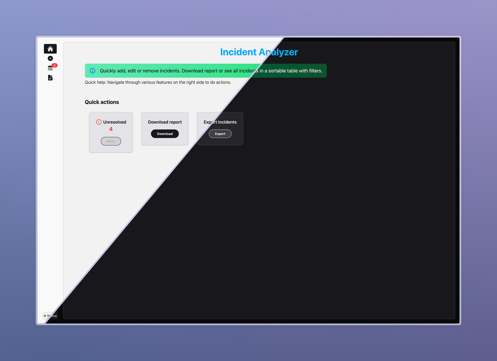
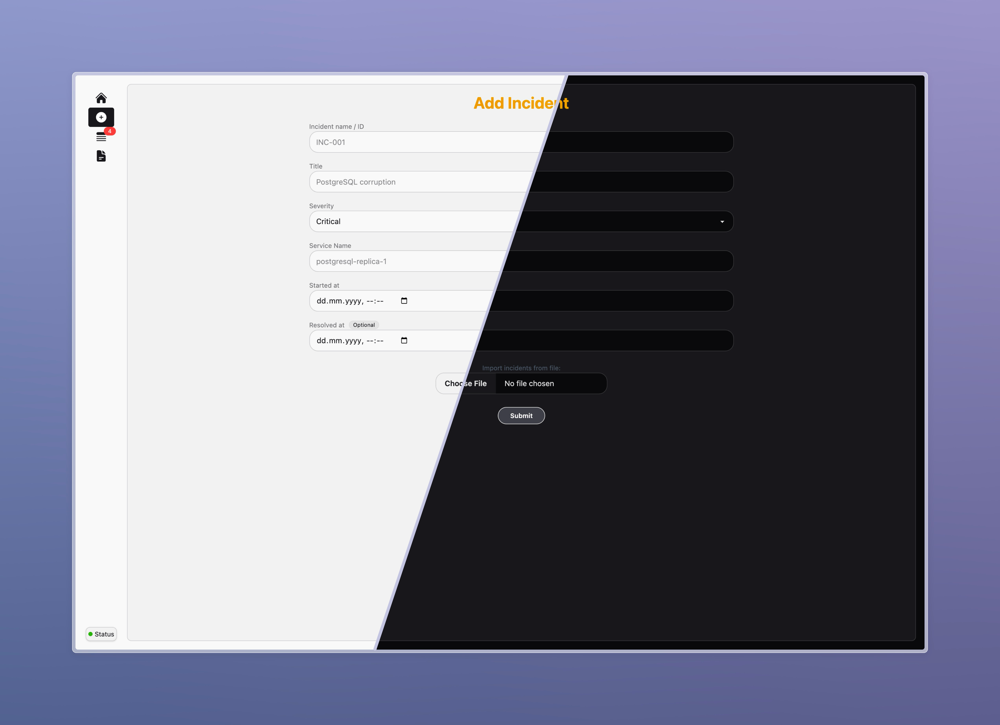
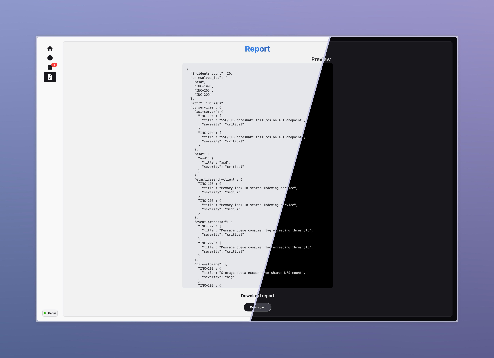

# Incident Management System (IMS)

Easily self-hostable, open-source and encrypted by default. Quickly add, edit or remove incidents. Download report or see all incidents in a sortable table with filters!

## REST API endpoints reference

| HTTP method | Endpoint name | Handler name | Note |
| ----------- | ------------- | ------------ | ---- |
| GET | `/api/healthz` | healthHandler | Backend status health |
| GET | `/api/report` | getReportHandler | Return incident report |
| GET | `/api/incidents` | getAllHandler | Return list of incidents |
| POST | `/api/incidents` | addListHandler | Retrives list of incidents |
| POST | `/api/incident` | addHandler | Retrives one incident |
| GET | `/api/incidents/{id}` | getByIDHandler | Return one incident by ID |
| DELETE | `/api/incidents/{id}` | deleteByIDHandler | Delete one incident by ID |

## Roadmap

- ✓ Multi-stage Dockerfile
- ✓ Add `docker-compose.yml`
- Create OCI rootless images
- Tutorial how to run this tool
- Create Helm Chart for Kubernetes

## Screenshots

## Issues & Contributing

If you have any problems or ideas on other features to add, feel free to open an issue or create Pull Request.
