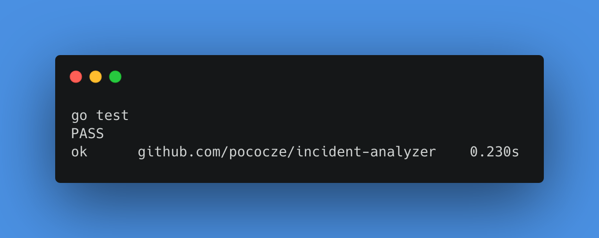

# Incident Log Analyzer

Quickly add, edit or remove incidents. Download report or see all incidents in a sortable table with filters!

## REST API endpoints reference

| HTTP method | Endpoint name | Handler name | Note |
| ----------- | ------------- | ------------ | ---- |
| GET | `/healthz` | healthHandler | Backend status health |
| GET | `/report` | getReportHandler | Return incident report |
| GET | `/incidents` | getAllHandler | Return list of incidents |
| POST | `/incidents` | addListHandler | Retrives list of incidents |
| POST | `/incident` | addHandler | Retrives one incident |
| GET | `/incidents/{id}` | getByIDHandler | Return one incident by ID |
| DELETE | `/incidents/{id}` | deleteByIDHandler | Delete one incident by ID |

## Todo

- Dockerfiles (frontend, backend)
- Create OCI rootless images
- Add `docker-compose.yml`
- Tutorial how to run this tool
- Create Helm Chart for Kubernetes

## Screenshots

## Go test

Tested one function `CalcMTTRAvg()`:

## Issues & Contributing

If you have any problems or ideas on other features to add, feel free to open an issue or create Pull Request.
